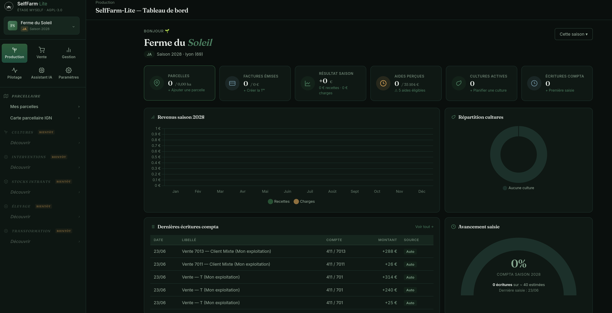
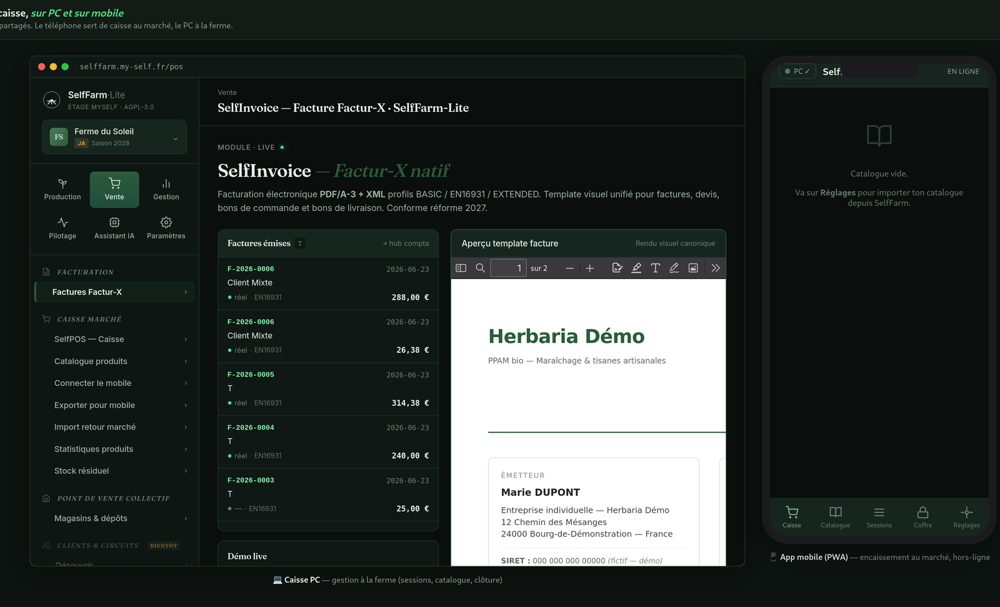
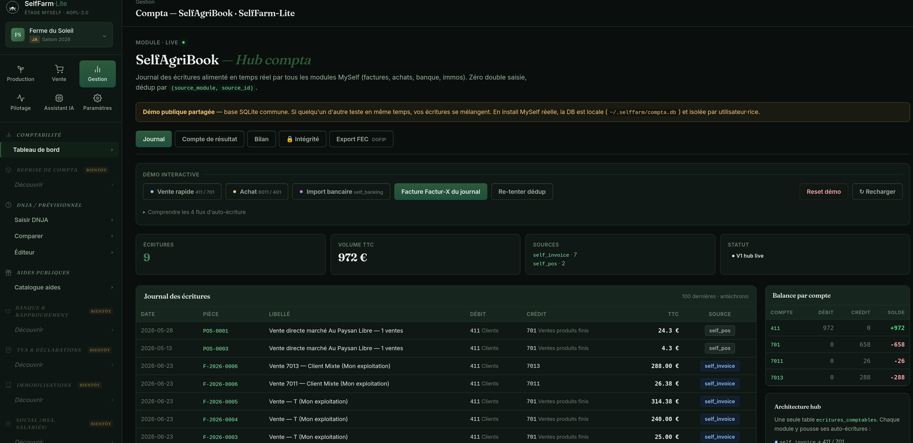
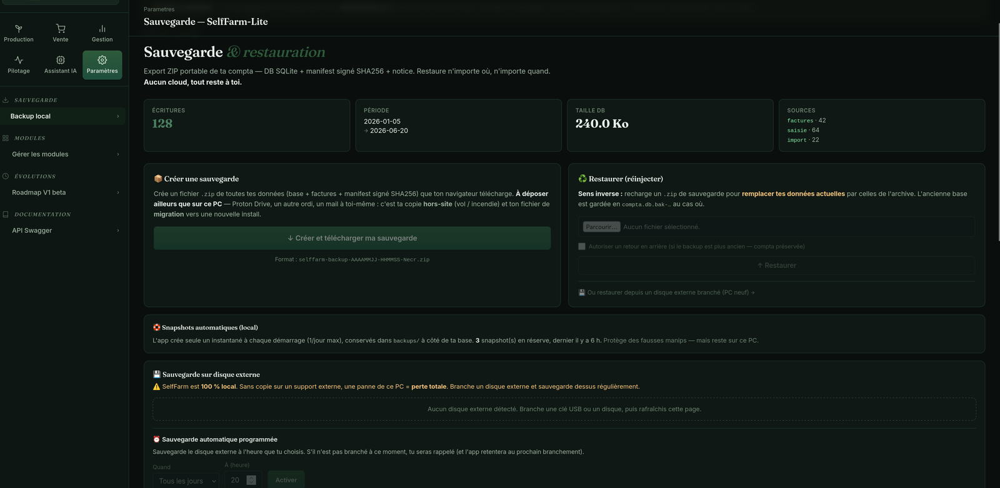
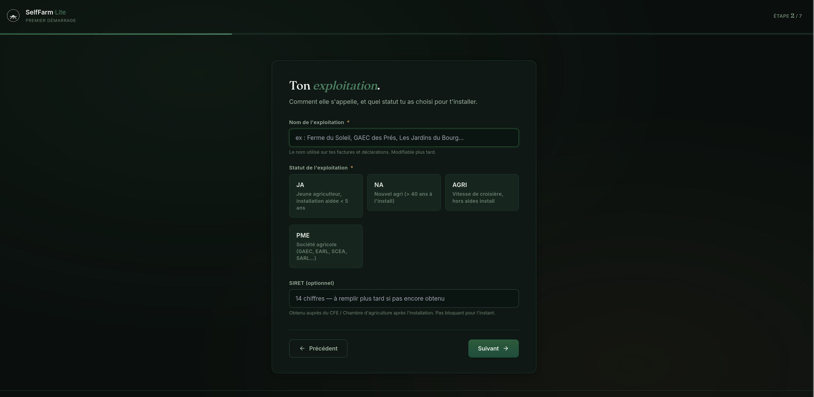
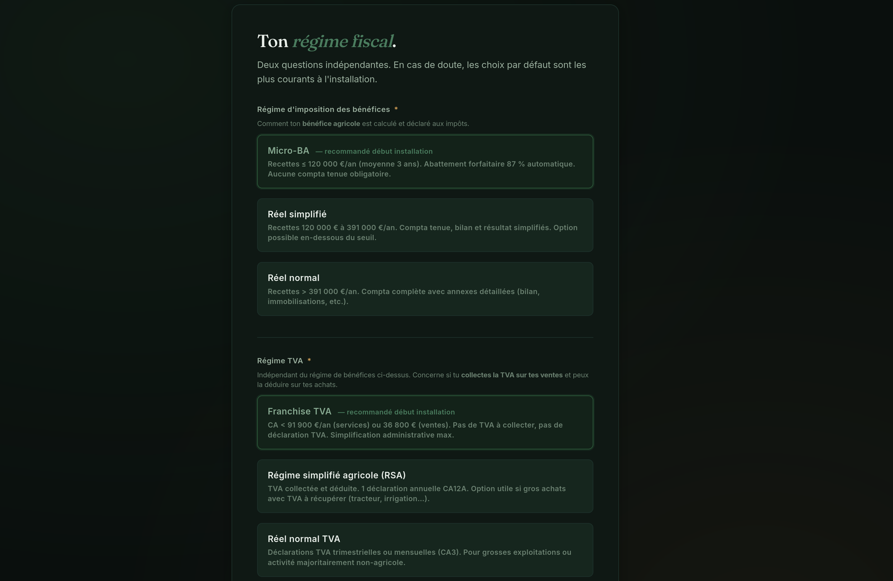
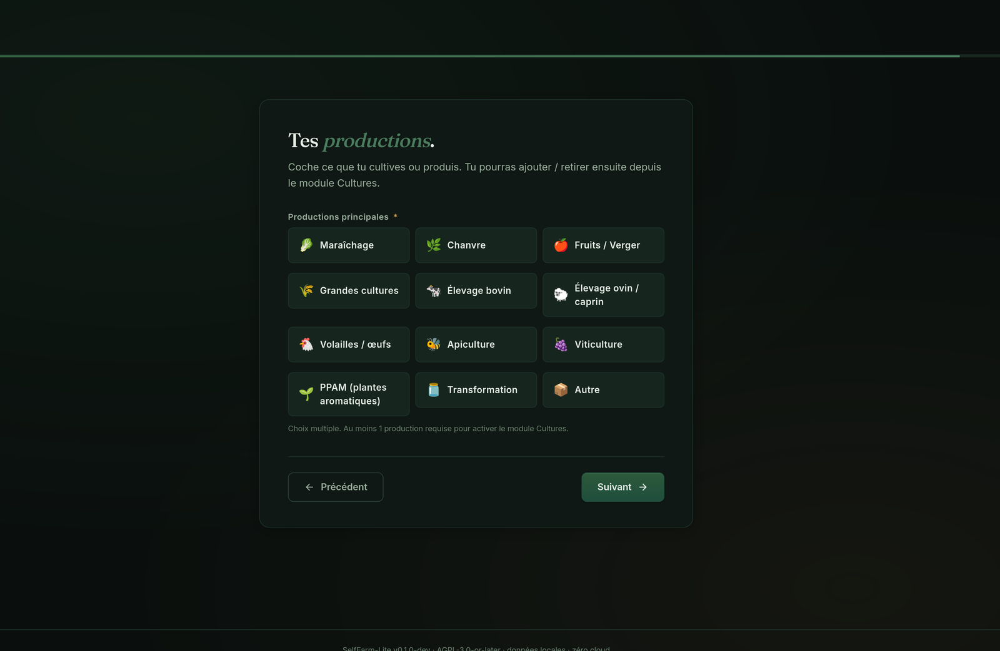

# SelfFarm-Lite

**Modules agricoles pour jeunes agriculteurs et petites exploitations** — AGPL-3.0-or-later.

Partie de l'écosystème [MySelf](https://github.com/Pierroons/my-self) — « l'étage
applicatif qui repose sur les 3 piliers » (identité / droit / sécurité).

## Modules publiés

<!-- modules:debut — généré par scripts/ecosysteme.py depuis modules.toml, ne pas éditer ici -->

| Module | Objet | État |
|---|---|:---:|
| [`self-agri-book`](modules/self_agri_book) | hub compta central — journal, bilan, compte de résultat, export FEC | disponible |
| [`self-invoice`](webapp/routes/invoice.py) | factures Factur-X pour trois régimes : franchise, micro-BA, réel | disponible |
| [`self-pos`](modules/self_pos) | caisse de marché sur PC et mobile hors ligne, à l'unité ou au poids, reportée au hub compta | disponible |
| [`self-pa`](modules/self_pa) | factures fournisseurs reçues par plateforme agréée, contrôlées, imputées après validation | disponible |
| [`self-dnja`](modules/self_dnja) | prévisionnel DNJA sur quatre ans et dossier PDF pour la CDOA | disponible |
| [`self-aid`](modules/self_aid) | catalogue des aides publiques, tiré de sources officielles | disponible |
| [`self-banking`](modules/self_banking) | lecture des relevés bancaires PDF, en vue du rapprochement | en préparation |
| [`self-culture`](modules/self_culture) | parcellaire et cultures, cartographie IGN | disponible |
| [`self-elevage`](modules/self_elevage) | élevage : ponte, bandes et mouvements, lots d'œufs, aliment, registre d'élevage | disponible |
| [`self-backup`](modules/self_backup) | sauvegarde et restauration, 100 % locales | disponible |
| [`self-factur-x-agri`](modules/self_factur_x_agri) | TVA agricole et unités HAR/TNE pour Factur-X | à fusionner dans self-invoice |

<!-- modules:fin -->

Ces modules sont utilisables **seuls ou combinés**, ils n'exigent aucun
ERP global et ne capturent aucune donnée dans le cloud.

**Démo live publique** : https://selffarm.my-self.fr

## Architecture hub central (depuis v0.2)

Tous les modules métier alimentent le **hub compta** `self_agri_book` via
auto-écritures. Zéro double saisie, dédup automatique par `(source_module, source_id)`.

```
┌────────────────────────────────────────────────────────┐
│  MODULE COMPTA (hub central — self_agri_book)          │
│  SQLite : ecritures_comptables                         │
│  → Journal + Bilan + Compte de résultat + FEC DGFIP    │
└────▲───────▲───────▲───────▲───────▲───────────────────┘
     │       │       │       │       │
┌────┴──┐ ┌──┴───┐ ┌─┴───┐ ┌─┴────┐ ┌┴───────┐
│Invoice│ │Achats│ │Immos│ │Banking│ │Manuel │
│(701)  │ │(6xxx)│ │(215)│ │ (512) │ │ vente │
└───────┘ └──────┘ └─────┘ └───────┘ └───────┘
```

**Conséquence** : chaque action dans un module (générer une facture,
importer un relevé, saisir un achat) met à jour en temps réel le journal,
le bilan, le compte de résultat et le FEC DGFIP.

## Conformité FR (v0.2)

- **Plan comptable** : PCG Agricole officiel 2026 (ANC + arrêté 1986 + règlement ANC 2019-01)
- **Export FEC** : conforme art. L47 A-I LPF + BOI-CF-IOR-60-40-10 (18 colonnes tab-separated)
- **Factur-X** : PDF/A-3 + XML CII, profils BASIC / EN16931 / EXTENDED (obligatoire sept 2026-2028)
- **Multi-régime** : franchise TVA (art. 293 B CGI), micro-BA, réel simplifié/normal
- **TVA agricole** : taux 5,5 % / 10 % / 20 %
- **Validation équilibre D/C** : Pydantic model validator (refus d'insertion sinon)

## Aperçu visuel



*Tableau de bord — vue d'ensemble de l'exploitation : résultat, aides éligibles, écritures compta, cultures.*



*SelfPOS — la même caisse sur PC (gestion à la ferme) et sur mobile (encaissement au marché, hors-ligne). Vente à l'unité ou au poids.*



*SelfAgriBook — le hub compta : journal alimenté en temps réel par tous les modules (factures, ventes, achats), zéro double saisie. Les ventes SelfPOS y remontent automatiquement.*



*Sauvegarde & restauration — export ZIP portable signé SHA256, 100 % local, aucun cloud.*

### Première installation (onboarding)





*Parcours guidé : statut (JA / NA / AGRI / PME), régime fiscal et TVA, productions de la ferme.*

## Quickstart

```bash
git clone <url-du-repo>
cd selffarm-lite
./install.sh          # installe venv + deps + exécute les tests
source .venv/bin/activate
export PYTHONPATH=modules:.

# Lancer la webapp (port 8001 par défaut)
uvicorn webapp.main:app --reload --port 8001
# → http://localhost:8001

# CLI DNJA
python -m self_dnja.cli calcul examples/hypotheses-demo-publique.yaml
python -m self_dnja.cli pdf examples/hypotheses-demo-publique.yaml -o dossier.pdf

# CLI Aides
python -m self_aid.cli list
python -m self_aid.cli search --statut ja-installation
python -m self_aid.cli search --bio --zone Dordogne
```

## Routes webapp live

| Route | Rôle |
|-------|------|
| `/` | Tableau de bord — Production / Vente / Gestion, accès à tous les modules |
| `/onboarding` | Parcours de première installation (exploitation, régime fiscal, productions) |
| `/pos` | **SelfPOS** — caisse de marché (PC), app mobile PWA sur `/pos/mobile` |
| `/dnja` | Simulateur prévisionnel + scénarios + éditeur + compare + PDF CDOA |
| `/aides` | Catalogue d'aides filtrable HTMX |
| `/parcelles` | Cartographie IGN + recherche parcelles cadastre |
| `/invoice` | Générateur Factur-X démo live (3 régimes) |
| `/compta` | Hub compta — journal + boutons démo multi-sources |
| `/compta/resultat` | Compte de résultat live (produits vs charges) |
| `/compta/bilan` | Bilan comptable — actif ↔ passif équilibré |
| `/compta/export-fec` | Export FEC DGFIP conforme (18 colonnes) |
| `/compta/facture-du-journal` | PDF Factur-X consolidé depuis les ventes 411/701 du journal |
| `/backup` | Sauvegarde & restauration ZIP (local, disque externe, planifiée) |
| `/docs` | Swagger UI auto-généré (21+ endpoints documentés) |

## Philosophie

- **Anti-capture SaaS** : self-hosted, vos données restent chez vous (SQLite local)
- **Modulaire** : une brique = un besoin, pas d'ERP monolithique
- **Léger** : Python 3.13 + SQLite + HTML/htmx/Tailwind CDN, tourne sur un Raspberry Pi
- **Sources primaires** uniquement (Légifrance, BOFiP, service-public,
  mesdemarches.agriculture, FranceAgriMer, MSA, portails régionaux) — jamais
  de blog ni site marchand comme autorité
- **Factur-X natif 2026** là où c'est pertinent
- **Hub central** : une seule table vérité, zéro double saisie, dédup garantie
- **Versioning + logging obligatoires** par convention MySelf

## Stack technique

| Couche | Choix |
|---|---|
| Langage | Python 3.13 (3.11 min sur Raspberry Pi) |
| API | FastAPI + Starlette `>=1.3.1` |
| Validation données | Pydantic v2 (+ `model_validator` pour équilibre D/C) |
| BDD | SQLite local (1 fichier par utilisateur) |
| Front | HTML + htmx (server-rendered, pas de SPA) + Tailwind CSS CDN |
| PDF | WeasyPrint (HTML → PDF/A-3) + reportlab (prévis DNJA) |
| Parser banque | pdfplumber (reconstruction depuis `extract_words()` X/Y) |
| Factur-X | XML CII EN16931 + PDF/A-3 embedded |
| Tests | pytest + pytest-cov |
| Lint | ruff |
| CI | GitHub Actions (lint + tests + validation YAML) |
| Deploy | Docker multi-arch (Raspberry Pi 4 compatible) |
| Proxy prod | nginx + Let's Encrypt (certbot) |
| Haute dispo | Watchdog matériel (reboot auto si kernel panic) |

## Dossiers importants

- `modules/self_agri_book/` — hub compta SQLite + bilan/résultat/FEC
- `modules/self_pos/` — SelfPOS : caisse marché PC + mobile (PWA), ventes → hub compta
- `modules/self_dnja/` — moteur prévisionnel + PDF + 16 tests
- `modules/self_aid/` — catalogue aides + CLI + 13 tests
- `modules/self_banking/` — parsers PDF relevés (SG fait, CA/CM à venir)
- `modules/self_culture/` — parcellaire + cultures (cartographie IGN cadastre)
- `modules/self_backup/` — sauvegarde / restauration ZIP signée SHA256
- `modules/self_factur_x_agri/` — Factur-X agricole (TVA, UOM HAR/TNE)
- `modules/self_aid/data/aides-agri-2026.yaml` — aides JA nationales et régionales 2026
  (les aides départementales se placent dans `data/local/`, non versionné)
  sourcées officiellement avec date de vérification
- `modules/self_agri_book/data/pcg-agricole-2026.yaml` — **Plan comptable
  agricole officiel 2026** (9 classes, 396 comptes, 133 agri-spécifiques)
- `webapp/` — routes FastAPI + templates Jinja2 + static assets
- `examples/` — hypothèses DNJA types + YAML démo publique anonymisé
- `docs/` — analyses architecture (Ekylibre, Odoo, libs Factur-X, API Viva,
  spec SelfInvoice v0.2)
- `.github/workflows/ci.yml` — CI GitHub Actions prête
- `Dockerfile` — image multi-arch (amd64 + arm64)

## Couverture des tests

```bash
PYTHONPATH=modules .venv/bin/python -m pytest modules/ -v
```

29+ tests passent (moteur DNJA + loader/filtrage aides + écritures
compta + parser SG). Hub compta testé E2E en conditions réelles :
lettrage auto + dédup + équilibre bilan.

## Prior art

Conception informée par l'observation de :

- [Ekylibre](https://github.com/ekylibre/ekylibre) (AGPLv3) — FMIS Rails
  complet (2M+ lignes de code, Ruby 2.6 / Rails 5.2), trop lourd pour
  installation solo. **Complémentaire**, pas concurrent : SelfFarm-Lite est
  un « on-ramp » pour néo-installés, migration vers Ekylibre possible à
  croissance.
- [Ouvretaferme](https://github.com/emilieguth/ouvretaferme) (licence maison,
  **non-OSI**) — gestion maraîchage PHP, non réutilisable
- [Odoo `account_edi_ubl_cii`](https://github.com/odoo/odoo/tree/19.0/addons/account_edi_ubl_cii)
  (LGPL) — patterns Factur-X utilisés comme inspiration

**SelfFarm-Lite est une implémentation originale Python. Aucun code n'a été
repris de ces projets.** Les nomenclatures (PCG agricole, barèmes aides,
taxes) viennent des sources officielles ouvertes (ANC, impots.gouv.fr,
FranceAgriMer, Légifrance, MSA, portails régionaux).

## Intégration écosystème MySelf

SelfFarm-Lite est l'**étage applicatif agricole** de l'écosystème
[MySelf](https://my-self.fr). Autonome par défaut, il est conçu pour s'appuyer
sur les 3 piliers MySelf — intégrations à des stades divers (de l'opérationnel
à la R&D), pas toutes câblées à ce jour. Les modules de MySelf, tels que
[leur manifeste](https://github.com/Pierroons/my-self/blob/main/modules.json) les publie :

<!-- ecosysteme:my-self:debut — généré par scripts/ecosysteme.py depuis le modules.json de my-self, ne pas éditer ici -->

- **SelfRecover** 0.8.0 — récupération de compte sans email ni SMS
- **SelfModerate** 0.4.0 — modération communautaire par raisonnement social
- **SelfJustice** 0.4.2 — consultation du droit français et européen par une API publique
- **SelfAct** 0.1.3 — modèles officiels et calcul des délais de procédure
- **SelfDataGuard** 0.5.0 — chiffrement des données au repos côté application

<!-- ecosysteme:my-self:fin -->

Ce que SelfFarm-Lite en attend : récupérer l'accès à son instance sans email
(SelfRecover), modérer les données partagées entre exploitations (SelfModerate),
consulter le droit applicable aux litiges agricoles, bail rural compris
(SelfJustice), calculer les délais d'une procédure (SelfAct), chiffrer les données
comptables au repos (SelfDataGuard).

## Licence

[AGPL-3.0-or-later](LICENSE) — le bouclier open source anti-capture SaaS du
MySelf.

## Auteur

[Pierroons](https://github.com/Pierroons) — mainteneur.
Bricole des outils libres pour l'agriculture, pour que les données poussent pas dans le cloud.
Contact : contact@my-self.fr

Co-écrit avec **Claude** (Anthropic).
